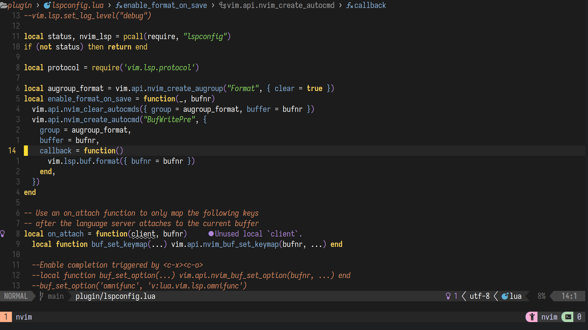

---

## Neovim Config

An epic neovim setup originally forked from the talented dev [Takuya Matsuyama](https://github.com/craftzdog)

**Features**

- Sleek, minimal, but functional
- Packer.nvim
- Telescope fuzzy find files and keywords
- Mason lsp
- Null-ls with eslint_d formatter
- Lspkind, lspsaga for aesthetics

**Dependencies**

- Nerd Font
- fzf
- eslint_d
